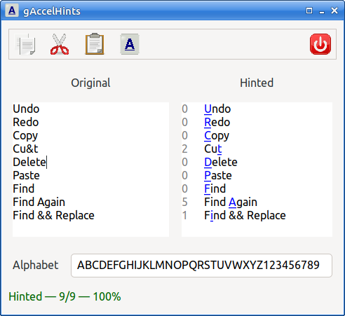

# gaccelhints

A Go/Gtk application for efficiently calculating keyboard accelerators.

This is useful for menus and dialogs, especially when there are lots of
accelerators required.

## License

GPL-3

---
